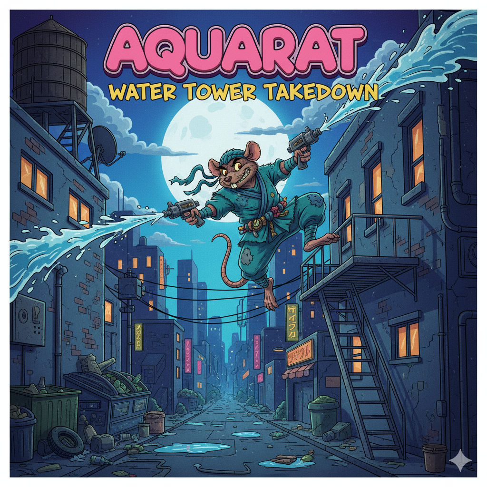

<div align="center">



# nanochatAquaRat

**Training Language Models with Reinforcement Learning on Mathematical Reasoning**

[](https://github.com/HarleyCoops/nanochatAquaRat)
[](LICENSE)
[](https://www.python.org/downloads/)

A modified version of [nanochat](https://github.com/karpathy/nanochat) trained with reinforcement learning on the [DeepMind AQuA-RAT dataset](https://huggingface.co/datasets/deepmind/aqua_rat) for algebraic reasoning and multiple-choice problem solving.

[Quick Start](#quick-start) • [Dataset](#dataset-structure) • [Modifications](#modifications-from-base-nanochat) • [Training](#training-pipeline) • [Results](#results)

</div>

---

## Table of Contents

- [Overview](#overview)
- [The Base: nanochat Framework](#the-base-nanochat-framework)
- [Dataset Structure](#dataset-structure)
- [Modifications from Base nanochat](#modifications-from-base-nanochat)
- [Training Pipeline](#training-pipeline)
- [Quick Start](#quick-start)
- [File Structure](#file-structure)
- [Monitoring & Visualization](#monitoring--visualization)
- [Results](#results)

---

## Overview

This project adapts the **nanochat** training framework (originally designed for GSM8K numerical reasoning) to work with **AQuA-RAT** (Algebra Question Answering with Rationales), a dataset of ~97,000 algebraic word problems with multiple-choice answers (A-E) and natural language solution rationales.

### Why This Matters

- **Domain Transfer**: Demonstrates how to adapt a mathematical reasoning pipeline from free-form numeric answers to multiple-choice format
- **RL on Math**: Implements GRPO-style reinforcement learning with reward shaping for categorical outputs
- **Mechanistic Interpretability**: Integrates attention analysis during training to understand model reasoning patterns
- **Production-Ready**: Includes automated Lambda Labs deployment for cloud GPU training

### Key Results

| Model | Parameters | Training Time | AQuA-RAT Dev Accuracy |
|-------|------------|---------------|----------------------|
| depth-8 | ~60M | 3-4 hours | 30-50% |
| depth-20 | ~561M | 6-8 hours | 40-60% |

---

## The Base: nanochat Framework

**nanochat** is a minimalist yet complete pipeline for training transformer language models from scratch, created by Andrej Karpathy. It implements:

- **Custom tokenizer**: BPE tokenizer written in Rust for performance
- **Training stages**: Pretraining → Mid-training → SFT → RL
- **Evaluation suite**: CORE benchmarks and task-specific metrics
- **Optimizations**: Memory-efficient training, gradient accumulation, distributed training

**Original focus**: Training on GSM8K (Grade School Math 8K) with free-form numeric answers.

### Architecture

```
Input Tokens → Embedding
    ↓
Transformer Blocks (depth N)
    • Multi-head attention (causal)
    • MLP with GELU
    • Layer normalization
    • Residual connections
    ↓
Output Logits → Next Token Prediction
```

**Key hyperparameters**:
- Model depth: 8, 12, 20, or 26 layers
- Hidden size: Scales with depth
- Vocabulary: 65,536 tokens (2^16)
- Context length: 2048 tokens

---

## Dataset Structure

### AQuA-RAT Format

The [DeepMind AQuA-RAT dataset](https://github.com/deepmind/AQuA) contains algebraic reasoning problems in JSON format:

```json
{
  "question": "A person is traveling at 20 km/hr and reached his destiny in 2.5 hr then find the distance?",
  "options": [
    "A) 53 km",
    "B) 55 km", 
    "C) 52 km",
    "D) 60 km",
    "E) 50 km"
  ],
  "rationale": "The distance that the person traveled = 20 * 2.5 = 50 km. Answer: E",
  "correct": "E"
}
```

**Dataset splits**:
- Training: 97,467 problems
- Development: 254 problems  
- Test: 254 problems

**Key characteristics**:
- Multiple-choice (A-E) format
- Algebraic word problems
- Natural language rationales
- Topics: arithmetic, algebra, geometry, probability

### Comparison: GSM8K vs AQuA-RAT

| Aspect | GSM8K (Original) | AQuA-RAT (This Project) |
|--------|------------------|-------------------------|
| **Format** | Free-form numeric | Multiple choice (A-E) |
| **Answer** | Single number | Letter choice |
| **Size** | 8,500 problems | 97,700 problems |
| **Difficulty** | Elementary school | High school algebra |
| **Rationale** | Step-by-step | Natural language |
| **Evaluation** | Exact match on number | Categorical accuracy |

---

## Modifications from Base nanochat

To adapt nanochat from GSM8K to AQuA-RAT, we modified the following components:

### 1. Dataset Loader (`scripts/prepare_aqua.py`)

**Created new file** to download and format AQuA-RAT:

```python
# New file: scripts/prepare_aqua.py
def download_aqua(output_dir):
    """Download train/dev/test splits from DeepMind GitHub"""
    base_url = "https://raw.githubusercontent.com/google-deepmind/AQuA/master/"
    for split in ['train', 'dev', 'test']:
        download_file(f"{base_url}{split}.json", f"{output_dir}/{split}.json")

def format_for_sft(examples):
    """Convert AQuA format to nanochat conversation format"""
    # Format: <|user|>Problem<|assistant|>Rationale + Answer
```

### 2. Task Module (`tasks/aqua.py`)

**Created new task handler** following the GSM8K interface:

```python
# New file: tasks/aqua.py
def load_split(base_dir, split='train'):
    """Load AQuA examples from JSON files"""
    
def render_prompt(example):
    """Format problem as prompt with multiple choice options"""
    return f"""You are a careful math tutor. Solve step by step.

Problem: {example['question']}

Choices:
{format_options(example['options'])}

Think step by step. On the last line, output exactly:
Final Answer: <LETTER>
"""

def extract_letter(completion):
    """Parse A-E from model output using regex"""
    
def reward_from_completion(example, completion):
    """Return 1.0 if letter matches, 0.0 otherwise + shaping bonus"""
```

**Key differences from GSM8K**:
- Numeric extraction → Letter extraction
- Free-form answer → Fixed choices A-E
- Exact number match → Categorical match

### 3. RL Training (`scripts/chat_rl.py`)

**Modified** to support both GSM8K and AQuA-RAT:

```python
# Modified: scripts/chat_rl.py
parser.add_argument('--dataset', choices=['GSM8K', 'AQUA'])
parser.add_argument('--aqua_path', type=str)

# Dataset routing
if args.dataset == 'AQUA':
    from tasks.aqua import load_split, render_prompt, reward_from_completion
    train_iter = load_split(args.aqua_path, split='train')
```

**Added RL telemetry**:
```python
# New telemetry features
def _letter_metrics(model_p, model_q, prompt, completion):
    """
    Compute KL divergence between current and reference policy
    at the letter-choice decision point (Final Answer: X)
    Returns: (kl, margin, predicted_letter, distribution)
    """

def _sequence_kl_mc(model_p, model_q, prompt, completion):
    """
    Monte Carlo estimate of sequence-level KL divergence
    using teacher forcing on the sampled completion
    """
```

### 4. Evaluation (`scripts/chat_eval.py`)

**Added AQuA evaluation branch**:

```python
# Modified: scripts/chat_eval.py
elif args.a == 'AQUA':
    from tasks.aqua import load_split, render_prompt, extract_letter
    dev = list(load_split(aqua_path, 'dev'))
    
    # Categorical accuracy evaluation
    correct = 0
    for ex in dev:
        completion = engine.generate(render_prompt(ex))
        pred = extract_letter(completion)
        correct += int(pred == ex['correct'])
    
    accuracy = correct / len(dev)
    wandb.log({'eval/aqua_dev_acc': accuracy})
```

### 5. Training Script (`run_aquarat_small.sh`)

**Modified from base nanochat**:

```bash
# Added: AQuA-RAT dataset preparation
AQUA_DIR="$NANOCHAT_BASE_DIR/aqua"
python -m scripts.prepare_aqua --output_dir "$AQUA_DIR"

# Added: Mechanistic interpretability setup
MECH_INTERP_DIR="$NANOCHAT_BASE_DIR/mechanistic_interpretability"
git clone https://github.com/google-deepmind/mechanistic-interp.git "$MECH_INTERP_DIR"

# Modified: SFT stage to use AQuA
torchrun -m scripts.sft_train -- \
  --dataset=AQUA \
  --aqua_path="$AQUA_DIR"

# Added: RL stage with AQuA
torchrun -m scripts.chat_rl -- \
  --dataset=AQUA \
  --aqua_path="$AQUA_DIR" \
  --group_size=2 \
  --max_new_tokens=64 \
  --kl_every=100 \
  --max_steps=200
```

### 6. Attention Logging (`nanochat/attn_logging.py`)

**Created new module** for mechanistic interpretability:

```python
# New file: nanochat/attn_logging.py
@contextmanager
def capture_attention(model):
    """Monkey-patch attention layers to capture softmax matrices"""

def log_attention_summary(model, step):
    """
    Log per-layer attention entropy and heatmaps to W&B
    Helps understand how attention patterns evolve during RL
    """
```

**Modified `nanochat/gpt.py`**:
```python
# Modified: nanochat/gpt.py - CausalSelfAttention class
def _forward_with_attn(self, x):
    """Expose attention weights for logging"""
    # ... compute attention ...
    return y, att  # Return both output and attention matrix
```

---

## Training Pipeline

### Stage 1: Base Pretraining (50-60% of time)

**What happens**: Model learns language from scratch on FineWeb corpus

```bash
torchrun --nproc_per_node=8 -m scripts.base_train -- --depth=8
```

**Duration**: 1.5-2 hours on 8x H100  
**Output**: Base checkpoint with general language understanding  
**Metrics**: Validation loss, CORE benchmark scores

### Stage 2: Mid-Training (12-15% of time)

**What happens**: Teach conversation format and special tokens

```bash
torchrun --nproc_per_node=8 -m scripts.mid_train
```

**Duration**: 30 minutes  
**Output**: Conversational checkpoint  
**Metrics**: Format adherence, tool use capability

### Stage 3: Supervised Fine-Tuning (12-15% of time)

**What happens**: Fine-tune on AQuA-RAT with ground-truth solutions

```bash
torchrun --nproc_per_node=8 -m scripts.sft_train -- --dataset=AQUA
```

**Duration**: 30 minutes  
**Output**: AQuA-tuned checkpoint  
**Metrics**: Dev set accuracy (categorical)

### Stage 4: Reinforcement Learning (12-15% of time)

**What happens**: Policy gradient learning with GRPO algorithm

```bash
torchrun --nproc_per_node=1 -m scripts.chat_rl -- \
  --dataset=AQUA \
  --max_steps=200 \
  --group_size=2
```

**Duration**: 30 minutes  
**Algorithm**: Group Relative Policy Optimization (GRPO)  
**Reward**: +1.0 for correct letter, +0.1 for valid letter format  
**Output**: RL-optimized checkpoint

**Logged metrics**:
- `rl/acc` - Accuracy on training samples
- `rl/mean_reward` - Average reward per generation
- `rl/kl_letter_mean` - KL divergence at decision point
- `rl/kl_sequence_mean` - Full sequence KL
- `rl/letter_margin_mean` - Confidence (logit gap)
- `attn/entropy_mean` - Attention mechanism patterns

---

## Quick Start

### Option 1: Lambda Labs Cloud (Automated)

Use the automation helper for one-command deployment:

```bash
# Set credentials
export LAMBDA_API_KEY='your-lambda-api-key'
export WANDB_API_KEY='your-wandb-api-key'

# Launch with auto-start
python scripts/launch_lambda_training.py \
  --ssh-key-name your_lambda_ssh_key \
  --instance-type gpu_8x_h100_sxm5 \
  --region us-west-1 \
  --auto-start \
  --inject-env WANDB_API_KEY
```

The script provisions the instance, clones this repository, sets up environment variables, and starts training in a tmux session.

**Monitor training**:
```bash
# SSH to instance
ssh ubuntu@<INSTANCE_IP>

# Attach to tmux session
tmux attach -t nanochat-train

# Or view logs
tail -f ~/nanochatAquaRat/training.log
```

### Option 2: Lambda Labs Cloud (Manual)

For step-by-step control, see [LAMBDA_MANUAL_SETUP.md](LAMBDA_MANUAL_SETUP.md).

**Quick summary**:
1. Launch instance at https://cloud.lambdalabs.com/instances
2. SSH to instance: `ssh ubuntu@<IP>`
3. Clone repo: `git clone <repo-url> && cd nanochatAquaRat`
4. Set up credentials: `echo "WANDB_API_KEY=..." > .env`
5. Run training: `bash run_aquarat_small.sh`

### Option 3: Alternative Launcher Script

A simplified launcher is also available:

```bash
export LAMBDA_API_KEY='your-key'
export WANDB_API_KEY='your-key'

python launch_lambda.py \
  --instance-type gpu_8x_h100_sxm5 \
  --region us-west-1
```

See [QUICKSTART.md](QUICKSTART.md) for details.

### Option 4: Local/Custom Setup

```bash
# Setup environment
cp .env.template .env
# Edit .env with your WANDB_API_KEY

# Run training
bash run_aquarat_small.sh
```

**Requirements**:
- Python 3.8+
- CUDA GPUs (8x recommended)
- 40GB+ GPU memory per GPU
- ~100GB disk space

---

## File Structure

```
nanochatAquaRat/
├── scripts/
│   ├── launch_lambda_training.py  # NEW: Comprehensive launcher
│   ├── prepare_aqua.py             # NEW: AQuA dataset downloader
│   ├── base_train.py               # Modified: Added interp hooks
│   ├── sft_train.py                # Modified: AQuA support
│   ├── chat_rl.py                  # Modified: AQuA + telemetry
│   └── chat_eval.py                # Modified: Categorical eval
├── tasks/
│   ├── gsm8k.py                    # Original GSM8K task
│   └── aqua.py                     # NEW: AQuA task handler
├── nanochat/
│   ├── gpt.py                      # Modified: Attention exposure
│   ├── attn_logging.py             # NEW: Interpretability tools
│   └── ...                         # (other nanochat modules)
├── run_aquarat_small.sh            # NEW: AQuA training script
├── launch_lambda.py                # NEW: Simple deployment
├── QUICKSTART.md                   # NEW: Quick start guide
└── LAMBDA_MANUAL_SETUP.md          # NEW: Manual setup guide
```

### Summary of Code Changes

| File | Type | Description |
|------|------|-------------|
| `scripts/prepare_aqua.py` | NEW | Downloads AQuA-RAT from DeepMind GitHub |
| `scripts/launch_lambda_training.py` | NEW | Full-featured Lambda Labs automation |
| `tasks/aqua.py` | NEW | AQuA task handler (load, prompt, evaluate) |
| `nanochat/attn_logging.py` | NEW | Attention capture and W&B logging |
| `scripts/chat_rl.py` | MODIFIED | Added `--dataset=AQUA`, KL telemetry |
| `scripts/chat_eval.py` | MODIFIED | Added categorical eval for AQuA |
| `scripts/sft_train.py` | MODIFIED | Added `--dataset=AQUA` support |
| `nanochat/gpt.py` | MODIFIED | Exposed attention weights |
| `run_aquarat_small.sh` | NEW | Complete training pipeline |
| `launch_lambda.py` | NEW | Simplified Lambda launcher |

---

## Monitoring & Visualization

All metrics stream to [Weights & Biases](https://wandb.ai) in real-time:

**Training Metrics**:
- Loss curves (pretraining, SFT, RL)
- Learning rate schedules
- Gradient norms

**RL Metrics**:
- Policy performance (accuracy, rewards)
- KL divergence from initial policy
- Letter-choice distributions (A-E)
- Confidence margins

**Interpretability**:
- Attention heatmaps per layer
- Entropy evolution across training
- Token-level attention weights

Example W&B dashboard:
```
rl/acc                    ━━━━━━━━━━ 0.45
rl/kl_letter_mean        ━━━━━━━━━━ 0.12
rl/letter_margin_mean    ━━━━━━━━━━ 2.34
attn/entropy_mean        ━━━━━━━━━━ 3.21
```

---

## Results

### Model Configurations

| Depth | Parameters | Training Time | Best Instance Type | Estimated Cost |
|-------|------------|---------------|-------------------|----------------|
| 8     | ~60M       | 3-4 hours     | 1-2x A100        | ~$18-35        |
| 12    | ~180M      | 4-5 hours     | 4x A100          | ~$35-45        |
| 20    | ~561M      | 6-8 hours     | 8x H100          | ~$144-192      |
| 26    | ~1.1B      | 10-12 hours   | 8x H100          | ~$240-288      |

To change model depth, edit the `--depth` parameter in `run_aquarat_small.sh`.

### Expected Performance

**After SFT** (before RL):
- Dev accuracy: 20-30% (depth-8), 30-40% (depth-20)
- Basic problem-solving capability
- Some format errors (invalid letters)

**After RL**:
- Dev accuracy: 30-50% (depth-8), 40-60% (depth-20)
- Improved reasoning coherence
- Better multiple-choice selection confidence
- Reduced format errors
- Stable attention patterns

### Cost Management

Lambda Labs pricing (8x H100 SXM5 @ ~$24/hour):

| Model | Training Time | Total Cost |
|-------|---------------|------------|
| depth-8 (60M) | 3-4 hours | ~$96 |
| depth-20 (561M) | 6-8 hours | ~$192 |

Budget options:
- Test pipeline: 1x A10 @ $0.60/hr
- Small model: 2x A100 @ $4.40/hr  
- Production: 8x H100 @ $24/hr

---

## Important Notes

### For Lambda Labs Users
- **Always terminate instances** after training to avoid charges
- Monitor spending in the Lambda Labs dashboard
- Check instance availability before launching (high demand periods)

### Known Limitations
- RL on AQuA-RAT is experimental; results may vary
- Attention logging adds ~5-10% overhead
- KL computation can be expensive with large batch sizes
- Smaller models (<100M params) may struggle with complex reasoning

---

## Documentation

- **[scripts/launch_lambda_training.py](scripts/launch_lambda_training.py)** - Full-featured automation
- **[launch_lambda.py](launch_lambda.py)** - Simplified launcher
- **[QUICKSTART.md](QUICKSTART.md)** - Fast track guide
- **[LAMBDA_MANUAL_SETUP.md](LAMBDA_MANUAL_SETUP.md)** - Manual setup walkthrough
- **[.env.template](.env.template)** - Environment configuration

---

## Contributing

This project is based on the nanochat framework. For issues specific to:
- **AQuA-RAT training**: Open an issue in this repository
- **Base nanochat framework**: Refer to the upstream nanochat project
- **Lambda Labs deployment**: See documentation above

---

## License

This project inherits the license from the base nanochat project.

---

## Acknowledgments

- **Andrej Karpathy** - nanochat framework
- **DeepMind** - AQuA-RAT dataset and mechanistic interpretability tools
- **Lambda Labs** - Cloud GPU infrastructure
- **Weights & Biases** - Experiment tracking and visualization

---

## Support

- **Lambda Labs Support**: https://lambdalabs.com/support
- **Weights & Biases Docs**: https://docs.wandb.ai
- **Project Issues**: https://github.com/HarleyCoops/nanochatAquaRat/issues
