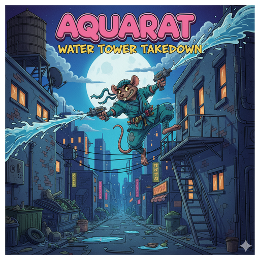

<div align="center">



# nanochatAquaRat

**Training Language Models with Reinforcement Learning on Mathematical Reasoning**

[](https://github.com/HarleyCoops/nanochatAquaRat)
[](LICENSE)
[](https://www.python.org/downloads/)

A modified version of [nanochat](https://github.com/karpathy/nanochat) trained with reinforcement learning on the [DeepMind AQuA-RAT dataset](https://huggingface.co/datasets/deepmind/aqua_rat) for algebraic reasoning and multiple-choice problem solving.

[Quick Start](#quick-start) • [Dataset](#dataset-structure) • [Modifications](#modifications-from-base-nanochat) • [Training](#training-pipeline) • [Results](#results)

</div>

---

## Table of Contents

- [Overview](#overview)
- [The Base: nanochat Framework](#the-base-nanochat-framework)
- [Dataset Structure](#dataset-structure)
- [Modifications from Base nanochat](#modifications-from-base-nanochat)
- [Training Pipeline](#training-pipeline)
- [Quick Start](#quick-start)
- [File Structure](#file-structure)
- [Monitoring & Visualization](#monitoring--visualization)
- [Results](#results)

---

## Overview

This project adapts the **nanochat** training framework (originally designed for GSM8K numerical reasoning) to work with **AQuA-RAT** (Algebra Question Answering with Rationales), a dataset of ~97,000 algebraic word problems with multiple-choice answers (A-E) and natural language solution rationales.

### Why This Matters

- **Domain Transfer**: Demonstrates how to adapt a mathematical reasoning pipeline from free-form numeric answers to multiple-choice format
- **RL on Math**: Implements GRPO-style reinforcement learning with reward shaping for categorical outputs
- **Mechanistic Interpretability**: Integrates attention analysis during training to understand model reasoning patterns
- **Production-Ready**: Includes automated Lambda Labs and Hyperbolic Labs deployment helpers for cloud GPU training

### Key Results

| Model | Parameters | Training Time | AQuA-RAT Dev Accuracy |
|-------|------------|---------------|----------------------|
| depth-8 | ~60M | 3-4 hours | 30-50% |
| depth-20 | ~561M | 6-8 hours | 40-60% |

---

## The Base: nanochat Framework

**nanochat** is a minimalist yet complete pipeline for training transformer language models from scratch, created by Andrej Karpathy. It implements:

- **Custom tokenizer**: BPE tokenizer written in Rust for performance
- **Training stages**: Pretraining → Mid-training → SFT → RL
- **Evaluation suite**: CORE benchmarks and task-specific metrics
- **Optimizations**: Memory-efficient training, gradient accumulation, distributed training

**Original focus**: Training on GSM8K (Grade School Math 8K) with free-form numeric answers.


---

## Dataset Structure

### AQuA-RAT Format

The [DeepMind AQuA-RAT dataset](https://github.com/deepmind/AQuA) contains algebraic reasoning problems in JSON format:

```json
{
  "question": "A person is traveling at 20 km/hr and reached his destiny in 2.5 hr then find the distance?",
  "options": [
    "A) 53 km",
    "B) 55 km", 
    "C) 52 km",
    "D) 60 km",
    "E) 50 km"
  ],
  "rationale": "The distance that the person traveled = 20 * 2.5 = 50 km. Answer: E",
  "correct": "E"
}
```

**Dataset splits**:
- Training: 97,467 problems
- Development: 254 problems  
- Test: 254 problems

**Key characteristics**:
- Multiple-choice (A-E) format
- Algebraic word problems
- Natural language rationales
- Topics: arithmetic, algebra, geometry, probability

### Comparison: GSM8K vs AQuA-RAT

| Aspect | GSM8K (Original) | AQuA-RAT (This Project) |
|--------|------------------|-------------------------|
| **Format** | Free-form numeric | Multiple choice (A-E) |
| **Answer** | Single number | Letter choice |
| **Size** | 8,500 problems | 97,700 problems |
| **Difficulty** | Elementary school | High school algebra |
| **Rationale** | Step-by-step | Natural language |
| **Evaluation** | Exact match on number | Categorical accuracy |

---

## Modifications from Base nanochat

To adapt nanochat from GSM8K to AQuA-RAT, we modified the following components:

### 1. Dataset Loader (`scripts/prepare_aqua.py`)

**Created new file** to download and format AQuA-RAT:

```python
# New file: scripts/prepare_aqua.py
### 1. Dataset Preparation (`scripts/prepare_aqua.py`)

- Uses `datasets.load_dataset("deepmind/aqua_rat")` and optionally caps split sizes.
- Emits JSONL files (`train.jsonl`, `validation.jsonl`, `test.jsonl`) compatible with
  the conversation schema used throughout nanochat.
- Defaults to `~/.cache/nanochat/aqua`, but accepts `--output_dir` overrides so
  launchers can bundle their own artifact.

```python
def format_example(row):
    options = row["options"]
    assistant_content = [
        {"type": "text", "text": row["rationale"].strip()},
        {"type": "text", "text": f"Answer: {row['correct'].strip().upper()}"},
    ]
    return {
        "messages": [
            {"role": "user", "content": _render_user_prompt(row["question"], options)},
            {"role": "assistant", "content": assistant_content},
        ],
        "letters": letters,
        "answer_letter": correct,
    }
```

### 2. Task Module (`tasks/aqua.py`)

- Accepts optional `data_dir` (or `AQUA_DATA_DIR` / `NANOCHAT_AQUA_DIR`) so the task
  can read the cached JSONL; otherwise falls back to Hugging Face.
- Provides `_render_user_prompt` to format the question/options using the common
  multiple-choice helper and `_extract_letter` to score completions.
- Returns conversations whose assistant messages include both the rationale and a
  final `Answer: <LETTER>` line for SFT, while `evaluate()` only cares about the letter.

```python
def _extract_letter(text, default=None):
    answer_match = re.search(r"answer\s*[:\-]\s*([A-E])", text, flags=re.IGNORECASE)
    if answer_match:
        return answer_match.group(1).upper()
    match = LETTER_RE.search(text)
    return match.group(1).upper() if match else default
```

**Key differences from GSM8K**:
- Numeric extraction → Letter extraction
- Free-form answer → Fixed choices A-E
- Exact number match → Categorical match

### 3. RL Training (`scripts/chat_rl.py`)

**Modified** to support both GSM8K and AQuA-RAT:

Key updates:

- `train_task` / `val_task` now instantiate `AQUA(...)` instead of `GSM8K(...)`.
- Rewards reuse the task's `evaluate()` helper so any completion containing
  “Answer: X” (or the first bare letter) is scored correctly.
- The validation helper became `run_aqua_eval`, still reporting pass@k accuracy
  across sampled completions.
- CLI overrides remain the same because the script continues to rely on the
  nanochat configurator (`--run`, `--temperature`, `--max_new_tokens`, …).

### 4. Evaluation (`scripts/chat_eval.py`)

- Registered `'AQUA'` in the task registry so `-a AQUA` just works.
- Added a 20% random-guess baseline when aggregating the ChatCORE metric.
- The categorical evaluation path reuses `run_categorical_eval`, clamping logits
  to the available letters before scoring.

### 5. Training Script (`run_aquarat_small.sh`)

**What changed vs upstream nanochat**:

```bash
# (Optional) Cache the dataset locally as JSONL
python -m scripts.prepare_aqua --output_dir "$NANOCHAT_BASE_DIR/aqua"

# Mid-training now samples from the AQuA mixture
torchrun -m scripts.mid_train -- --run=demo --num_iterations=200

# SFT stage emphasises AQuA problems
torchrun -m scripts.sft_train -- --run=demo --aqua_train_examples=20000

# RL fine-tuning rewards the correct letter on AQuA-RAT
torchrun -m scripts.chat_rl -- --run=demo --temperature=0.7 --max_new_tokens=64
```

- **`tasks/aqua.py`** loads AQuA-RAT either from Hugging Face or the cached JSONL
  splits, formats questions as conversations, and scores completions by letter.
- **`scripts/mid_train.py`** extends the original Reasoning+Chat mixture with a
  50k slice of AQuA so the model sees multiple-choice algebra earlier.
- **`scripts/chat_sft.py`** replaces the GSM8K component with AQuA, keeping ARC,
  SmolTalk, and identity prompts for general chat coverage.
- **`scripts/chat_rl.py`** retools the GRPO loop to sample, reward, and evaluate
  AQuA answers (categorical accuracy instead of GSM8K free-form math).
- **`scripts/chat_eval.py`** registers the new AQuA task so `chat_eval` can report
  categorical accuracy alongside ARC/MMLU/GSM8K/HumanEval.

---

## Training Pipeline

### Stage 1: Base Pretraining (50-60% of time)

**What happens**: Model learns language from scratch on FineWeb corpus

```bash
torchrun --nproc_per_node=8 -m scripts.base_train -- --depth=8
```

**Duration**: 1.5-2 hours on 8x H100  
**Output**: Base checkpoint with general language understanding  
**Metrics**: Validation loss, CORE benchmark scores

### Stage 2: Mid-Training (12-15% of time)

**What happens**: Teach conversation format and special tokens

```bash
torchrun --nproc_per_node=8 -m scripts.mid_train
```

**Duration**: 30 minutes  
**Output**: Conversational checkpoint  
**Metrics**: Format adherence, tool use capability

### Stage 3: Supervised Fine-Tuning (12-15% of time)

**What happens**: Fine-tune on AQuA-RAT with ground-truth solutions

```bash
torchrun --nproc_per_node=8 -m scripts.sft_train -- \
  --aqua_train_examples=20000 \
  --aqua_val_examples=254
```

**Duration**: 30 minutes  
**Output**: AQuA-tuned checkpoint  
**Metrics**: Dev set accuracy (categorical)

### Stage 4: Reinforcement Learning (12-15% of time)

**What happens**: Policy gradient learning with GRPO algorithm

```bash
torchrun --nproc_per_node=1 -m scripts.chat_rl -- \
  --temperature=0.7 \
  --max_new_tokens=64
```

**Duration**: 30 minutes  
**Algorithm**: Group Relative Policy Optimization (GRPO)  
**Reward**: +1.0 for correct letter, +0.1 for valid letter format  
**Output**: RL-optimized checkpoint

**Logged metrics**:
- `rl/acc` - Accuracy on training samples
- `rl/mean_reward` - Average reward per generation
- `rl/kl_letter_mean` - KL divergence at decision point
- `rl/kl_sequence_mean` - Full sequence KL
- `rl/letter_margin_mean` - Confidence (logit gap)
- `attn/entropy_mean` - Attention mechanism patterns

---

## Quick Start

### Repo Setup & Rust Toolchain

- Clone with submodules so the `rustbpe` tokenizer sources are present:
  ```bash
  git clone --recurse-submodules https://github.com/HarleyCoops/nanochatAquaRat.git
  ```
  For existing clones run `git submodule update --init --recursive` before building.
- Install Rust (needed for the tokenizer build). On Linux/macOS follow [https://rustup.rs](https://rustup.rs). On Windows, after installing rustup, ensure the toolchain is MSVC x86\_64 and the cargo bin directory is on `PATH`:
  ```powershell
  $env:Path += ";$env:USERPROFILE\.cargo\bin"
  setx PATH "$env:Path"
  setx CARGO_HOME "$env:USERPROFILE\.cargo"
  setx RUSTUP_HOME "$env:USERPROFILE\.rustup"
  rustup set default-host x86_64-pc-windows-msvc
  rustup default stable-x86_64-pc-windows-msvc
  cargo --version
  rustup --version
  ```
- Build the tokenizer once per machine:
  ```bash
  uv run maturin develop
  ```

### Option 1: Lambda Labs Cloud (Automated)

Use the automation helper for one-command deployment:

```bash
# Set credentials
export LAMBDA_API_KEY='your-lambda-api-key'
export WANDB_API_KEY='your-wandb-api-key'

# Launch with auto-start
python scripts/launch_lambda_training.py \
  --ssh-key-name your_lambda_ssh_key \
  --instance-type gpu_8x_h100_sxm5 \
  --region us-west-1 \
  --auto-start \
  --inject-env WANDB_API_KEY
```

The script provisions the instance, clones this repository, sets up environment variables, and starts training in a tmux session.

**Monitor training**:
```bash
# SSH to instance
ssh ubuntu@<INSTANCE_IP>

# Attach to tmux session
tmux attach -t nanochat-train

# Or view logs
tail -f ~/nanochatAquaRat/training.log
```

### Option 2: Hyperbolic Labs Cloud (Automated)

Spin up on-demand GPUs via Hyperbolic's marketplace API:

```bash
# Set credentials
export HYPERBOLIC_API_KEY='your-hyperbolic-api-key'
export WANDB_API_KEY='your-wandb-api-key'

# Launch with auto-start
python scripts/launch_hyperbolic_training.py \
  --gpu-count 1 \
  --region us-east \
  --auto-start \
  --inject-env WANDB_API_KEY
```

The launcher discovers an available node (respecting `--region`, `--supplier`, or `--max-price` filters), provisions it, copies your `.env`, and optionally starts training in tmux. Use `--list` to inspect available marketplace inventory without launching.

### Option 3: Lambda Labs Cloud (Manual)

For step-by-step control, see [LAMBDA_MANUAL_SETUP.md](LAMBDA_MANUAL_SETUP.md).

**Quick summary**:
1. Launch instance at https://cloud.lambdalabs.com/instances
2. SSH to instance: `ssh ubuntu@<IP>`
3. Clone repo: `git clone <repo-url> && cd nanochatAquaRat`
4. Set up credentials: `echo "WANDB_API_KEY=..." > .env`
5. Run training: `bash run_aquarat_small.sh`

### Option 4: Hyperbolic VM (Manual)

For marketplace nodes without automation access, follow this lightweight bootstrap:

1. Provision a GPU VM from the Hyperbolic console and copy the SSH command (including `-p <port>` and username).
2. SSH in and install prerequisites:
   ```bash
   sudo apt-get update
   sudo apt-get install -y git curl unzip build-essential python3 python3-venv tmux
   git clone https://github.com/HarleyCoops/nanochatAquaRat.git
   cd nanochatAquaRat
   ```
3. Create `.env` with the required keys (WANDB, GCS bucket, AQUA path) and upload your GCP service-account JSON to the VM, e.g. `scp -P <port> C:\path\to\credentials.json user@<ip>:/home/user/gcp-sa.json`.
4. Install tooling and build the tokenizer:
   ```bash
   curl -LsSf https://astral.sh/uv/install.sh | sh
   curl --proto '=https' --tlsv1.2 -sSf https://sh.rustup.rs | sh -s -- -y --default-toolchain stable
   source "$HOME/.cargo/env"
   export PATH="$HOME/.local/bin:$PATH"
   uv venv && uv sync --extra gpu
   source .venv/bin/activate
   uv run maturin develop
    uv run python -m scripts.tok_train
   ```
5. Install the Google Cloud SDK, authenticate, and stage the cached AQuA splits (or regenerate them):
   ```bash
   curl -sSL https://sdk.cloud.google.com | bash
   source "$HOME/.bashrc"
   gcloud auth login --no-launch-browser
   gcloud config set project <your-project-id>
   gcloud storage cp gs://nanochat-aquarat-datasets/datasets/aqua/aqua_cache.zip .
   unzip -o aqua_cache.zip -d ~/aqua_cache
   export AQUA_DATA_DIR=$HOME/aqua_cache
   ```
6. Fetch the identity conversation bundle (required for SFT) and the evaluation bundle once so CORE metrics don’t fail:
   ```bash
   cd ~/.cache/nanochat
   curl -L -o identity_conversations.jsonl https://karpathy-public.s3.us-west-2.amazonaws.com/identity_conversations.jsonl
   curl -L -o eval_bundle.zip https://karpathy-public.s3.us-west-2.amazonaws.com/eval_bundle.zip
   unzip -q eval_bundle.zip && rm eval_bundle.zip
   cd ~/nanochatAquaRat
   ```
7. Launch the desired script, e.g. `CUDA_VISIBLE_DEVICES=0 bash run_aquarat_lite.sh` or the full `run_aquarat_small.sh`.
8. Monitor training via tmux/W&B and terminate the VM from Hyperbolic when the run finishes to stop billing.

### Option 4: Alternative Launcher Script

A simplified launcher is also available:

```bash
export LAMBDA_API_KEY='your-key'
export WANDB_API_KEY='your-key'

python launch_lambda.py \
  --instance-type gpu_8x_h100_sxm5 \
  --region us-west-1
```

See [QUICKSTART.md](QUICKSTART.md) for details.

### Option 5: Local/Custom Setup

```bash
# Setup environment
cp .env.template .env
# Edit .env with your WANDB_API_KEY

# Run training
bash run_aquarat_small.sh
```

**Requirements**:
- Python 3.8+
- CUDA GPUs (8x recommended)
- 40GB+ GPU memory per GPU
- ~100GB disk space

---

## File Structure

```
nanochatAquaRat/
├── nanochat/…                         # Vendored upstream nanochat package
├── scripts/
│   ├── base_train.py                  # Base pretraining stage
│   ├── mid_train.py                   # Mid-training (now includes AQuA)
│   ├── chat_sft.py                    # Chat SFT pipeline
│   ├── sft_train.py                   # Shim so `-m scripts.sft_train` still works
│   ├── chat_rl.py                     # Reinforcement learning on AQuA-RAT
│   ├── chat_eval.py                   # Evaluation harness (adds AQuA task)
│   ├── prepare_aqua.py                # AQuA-RAT JSONL exporter
│   ├── launch_lambda_training.py      # Lambda Labs automation
│   ├── launch_hyperbolic_training.py  # Hyperbolic Labs automation
│   └── upload_to_gcs.sh               # Artifact helper
├── tasks/
│   ├── aqua.py                        # AQuA-RAT task implementation
│   ├── arc.py / gsm8k.py / mmlu.py    # Other reasoning tasks
│   └── …
├── run_aquarat_small.sh               # End-to-end orchestration
├── pyproject.toml / uv.lock           # Environment definitions
└── README.md
```
### Summary of Code Changes

| File | Type | Description |
|------|------|-------------|
| `tasks/aqua.py` | NEW | Conversation + evaluation wrapper for AQuA-RAT |
| `scripts/prepare_aqua.py` | NEW | Materializes train/validation/test JSONL splits for offline use |
| `scripts/mid_train.py` | MODIFIED | Adds AQuA to the mid-training mixture |
| `scripts/chat_sft.py` | MODIFIED | SFT mixture now includes AQuA controls |
| `scripts/sft_train.py` | NEW | Thin compatibility shim around `chat_sft` |
| `scripts/chat_rl.py` | MODIFIED | RL loop retargeted from GSM8K to AQuA-RAT |
| `scripts/chat_eval.py` | MODIFIED | Registers AQuA for categorical evaluation |
| `run_aquarat_small.sh` | MODIFIED | Pipeline glue aligned with AQuA staging |
| `scripts/launch_hyperbolic_training.py` | NEW | Hyperbolic Labs automation helper |
| `launch_lambda.py` / `scripts/launch_lambda_training.py` | EXISTING | Lambda Labs support retained |

---

## Monitoring & Visualization

All metrics stream to [Weights & Biases](https://wandb.ai) in real-time:

**Training Metrics**:
- Loss curves (pretraining, SFT, RL)
- Learning rate schedules
- Gradient norms

**RL Metrics**:
- Policy performance (accuracy, rewards)
- KL divergence from initial policy
- Letter-choice distributions (A-E)
- Confidence margins

**Interpretability**:
- Attention heatmaps per layer
- Entropy evolution across training
- Token-level attention weights

Example W&B dashboard:
```
rl/acc                    ━━━━━━━━━━ 0.45
rl/kl_letter_mean        ━━━━━━━━━━ 0.12
rl/letter_margin_mean    ━━━━━━━━━━ 2.34
attn/entropy_mean        ━━━━━━━━━━ 3.21
```

---

## Results

### Model Configurations

| Depth | Parameters | Training Time | Best Instance Type | Estimated Cost |
|-------|------------|---------------|-------------------|----------------|
| 8     | ~60M       | 3-4 hours     | 1-2x A100        | ~$18-35        |
| 12    | ~180M      | 4-5 hours     | 4x A100          | ~$35-45        |
| 20    | ~561M      | 6-8 hours     | 8x H100          | ~$144-192      |
| 26    | ~1.1B      | 10-12 hours   | 8x H100          | ~$240-288      |

To change model depth, edit the `--depth` parameter in `run_aquarat_small.sh`.

### Expected Performance

**After SFT** (before RL):
- Dev accuracy: 20-30% (depth-8), 30-40% (depth-20)
- Basic problem-solving capability
- Some format errors (invalid letters)

**After RL**:
- Dev accuracy: 30-50% (depth-8), 40-60% (depth-20)
- Improved reasoning coherence
- Better multiple-choice selection confidence
- Reduced format errors
- Stable attention patterns

### Cost Management

Lambda Labs pricing (8x H100 SXM5 @ ~$24/hour):

| Model | Training Time | Total Cost |
|-------|---------------|------------|
| depth-8 (60M) | 3-4 hours | ~$96 |
| depth-20 (561M) | 6-8 hours | ~$192 |

Budget options:
- Test pipeline: 1x A10 @ $0.60/hr
- Small model: 2x A100 @ $4.40/hr  
- Production: 8x H100 @ $24/hr

---

## Important Notes

### For Lambda Labs Users
- **Always terminate instances** after training to avoid charges
- Monitor spending in the Lambda Labs dashboard
- Check instance availability before launching (high demand periods)

### Known Limitations
- RL on AQuA-RAT is experimental; results may vary
- Attention logging adds ~5-10% overhead
- KL computation can be expensive with large batch sizes
- Smaller models (<100M params) may struggle with complex reasoning

---

## Documentation

- **[scripts/launch_lambda_training.py](scripts/launch_lambda_training.py)** - Full-featured automation
- **[scripts/launch_hyperbolic_training.py](scripts/launch_hyperbolic_training.py)** - Hyperbolic marketplace automation
- **[launch_lambda.py](launch_lambda.py)** - Simplified launcher
- **[QUICKSTART.md](QUICKSTART.md)** - Fast track guide
- **[LAMBDA_MANUAL_SETUP.md](LAMBDA_MANUAL_SETUP.md)** - Manual setup walkthrough
- **[GCS_UPLOAD_GUIDE.md](GCS_UPLOAD_GUIDE.md)** - Upload weights to Google Cloud Storage
- **[.env.template](.env.template)** - Environment configuration

---

## Contributing

This project is based on the nanochat framework. For issues specific to:
- **AQuA-RAT training**: Open an issue in this repository
- **Base nanochat framework**: Refer to the upstream nanochat project
- **Lambda Labs deployment**: See documentation above

---

## License

This project inherits the license from the base nanochat project.

---

## Acknowledgments

- **Andrej Karpathy** - nanochat framework
- **DeepMind** - AQuA-RAT dataset and mechanistic interpretability tools
- **Lambda Labs** - Cloud GPU infrastructure
- **Weights & Biases** - Experiment tracking and visualization

---

## Support

- **Lambda Labs Support**: https://lambdalabs.com/support
- **Weights & Biases Docs**: https://docs.wandb.ai
- **Project Issues**: https://github.com/HarleyCoops/nanochatAquaRat/issues

---

---
language: en
license: mit
datasets:
  - deepmind/aqua_rat
metrics:
  - accuracy
tags:
  - reinforcement-learning
  - autoformalization
  - education
  - nanochat
---

# nanochat AQuA-RL   
_A multiple-choice math apprentice that actually remembers its answer key._


## 1. Pipeline at a Glance

| Stage | What happens | Notes |
|-------|---------------|-------|
| Base  | Original nanochat pretraining | vanilla corpus |
| Mid   | Conversational alignment | SmolTalk + MMLU + GSM8K |
| SFT   | Supervised fine-tune on AQuA | `scripts.chat_sft` |
| RL    | Policy-gradient finetune on AQuA | `scripts.chat_rl`, 8× H100 (~30 min, 1,560 steps) |

**Debugging log:** the first RL attempt left rewards at zero. We later realised the reward function still looked for GSM8K numeric answers. Swapping to AQuA’s letter-based reward fixed the issue—reward curves now oscillate around 0.2–0.4 and pass@1 plateaued near 0.27.

## 2. Key Metrics (AQuA validation)

| Stage | Accuracy |
|-------|----------|
| SFT   | **27.56 %** |
| RL    | **27.17 %** |

SFT gives the big jump; RL keeps accuracy in range while stabilising formatting (“Answer: X”) and sampling.

## 3. Where to find the artifacts

| Item | Location |
|------|----------|
| RL checkpoint (`model_001560.pt`) | [HF repo](https://huggingface.co/HarleyCooper/nanochatAquaRat) & `gs://nanochat-aquarat-datasets/runs/aquarat-20251024-033245/chatrl_checkpoints/d8/` |
| Tokenizer (`tokenizer.pkl`, `token_bytes.pt`) | Same locations as above |
| Full report (`report.md`) | Same locations |
| Latest git commit | `git rev-parse HEAD` in this repo |

To pull everything from GCS:
```bash
gsutil -m cp -r gs://nanochat-aquarat-datasets/runs/aquarat-20251024-033245 ./aquarat_run
```

## 4. Inference quick-start

### CPU example
```python
from tasks.aqua import AQUA
from nanochat.checkpoint_manager import load_model
from nanochat.engine import Engine

model, tokenizer, _ = load_model("rl", device="cpu", phase="eval")
engine = Engine(model, tokenizer)

task = AQUA(split="validation", shuffle=False)
convo = task[0]
prompt = tokenizer.render_for_completion(convo)

generated, _ = engine.generate_batch(
    prompt,
    num_samples=1,
    max_tokens=64,
    temperature=0.7,
    top_k=50,
)
completion = tokenizer.decode(generated[0][len(prompt):])
print("Model output:\n", completion)
```

### GPU tip
The checkpoint is in bfloat16. When you generate on GPU, wrap the call in:

```python
with torch.cuda.amp.autocast(dtype=torch.bfloat16):
    generated, _ = engine.generate_batch(...)
```

## 5. Students: swapping in a new dataset

1. Prepare your dataset in the same conversation schema (`scripts/prepare_<your_dataset>.py`).
2. Update `scripts/chat_sft.py` & `scripts/chat_rl.py` (see how we switched to AQuA).
3. Rerun `run_aquarat_small.sh` (or your own driver) on multi-GPU hardware.
4. Replace `hf_release/` contents and rerun the HF upload.

## 6. Visuals & next steps

- Drop W&B reward/pass@1 graphs here once exported.
- Want to show pipeline plumbing? Draft a TKZ diagram, render it to PNG, and place it next to the hero image.

## 7. Credits & License

MIT License.
Built on nanochat by @HarleyCoops.
Questions? PRs welcome!

---
language: en
license: mit
datasets:
  - deepmind/aqua_rat
metrics:
  - accuracy
tags:
  - reinforcement-learning
  - autoformalization
  - education
  - nanochat
---

# nanochat AQuA-RL   
_A multiple-choice math apprentice that actually remembers its answer key._


## 1. Pipeline at a Glance

| Stage | What happens | Notes |
|-------|---------------|-------|
| Base  | Original nanochat pretraining | vanilla corpus |
| Mid   | Conversational alignment | SmolTalk + MMLU + GSM8K |
| SFT   | Supervised fine-tune on AQuA | `scripts.chat_sft` |
| RL    | Policy-gradient finetune on AQuA | `scripts.chat_rl`, 8× H100 (~30 min, 1,560 steps) |

**Debugging log:** the first RL attempt left rewards at zero. We later realised the reward function still looked for GSM8K numeric answers. Swapping to AQuA's letter-based reward fixed the issue—reward curves now oscillate around 0.2–0.4 and pass@1 plateaued near 0.27.

## 2. Key Metrics (AQuA validation)

| Stage | Accuracy |
|-------|----------|
| SFT   | **27.56 %** |
| RL    | **27.17 %** |

SFT gives the big jump; RL keeps accuracy in range while stabilising formatting ("Answer: X") and sampling.

## 3. Where to find the artifacts

| Item | Location |
|------|----------|
| RL checkpoint (`model_001560.pt`) | [HF repo](https://huggingface.co/HarleyCooper/nanochatAquaRat) & `gs://nanochat-aquarat-datasets/runs/aquarat-20251024-033245/chatrl_checkpoints/d8/` |
| Tokenizer (`tokenizer.pkl`, `token_bytes.pt`) | Same locations as above |
| Full report (`report.md`) | Same locations |
| Latest git commit | `git rev-parse HEAD` in this repo |

To pull everything from GCS:
```bash
gsutil -m cp -r gs://nanochat-aquarat-datasets/runs/aquarat-20251024-033245 ./aquarat_run
