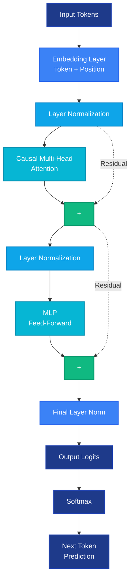

# Alternative Mermaid Diagram for GitHub

Here's a Mermaid version that shows residual connections and renders directly on GitHub:

This version:
- ✅ Renders directly on GitHub
- ✅ Shows residual connections with dashed lines
- ✅ Uses the same color scheme
- ✅ Shows proper transformer architecture
- ✅ Includes softmax layer
